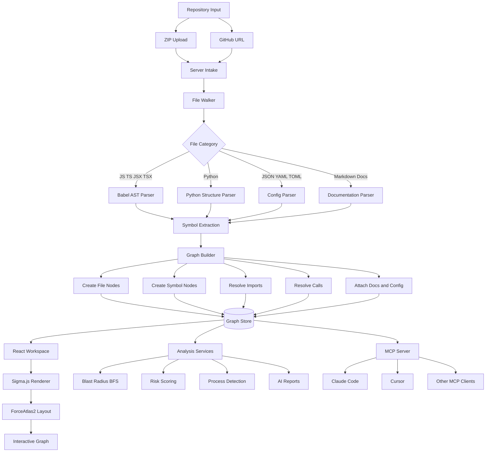
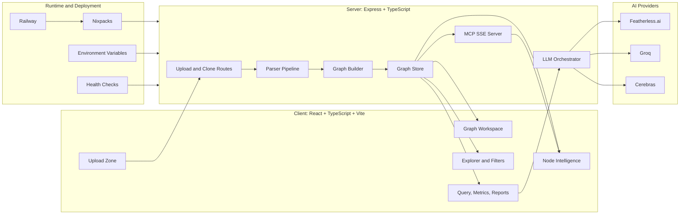
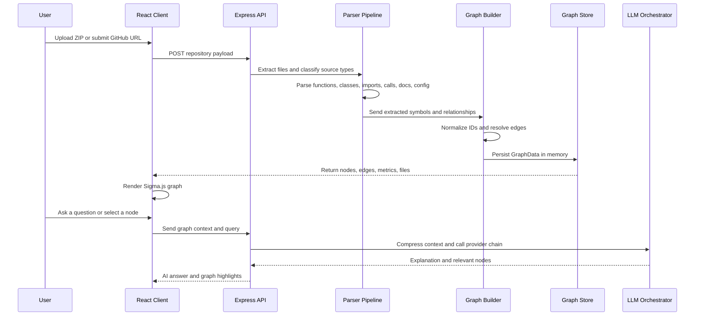
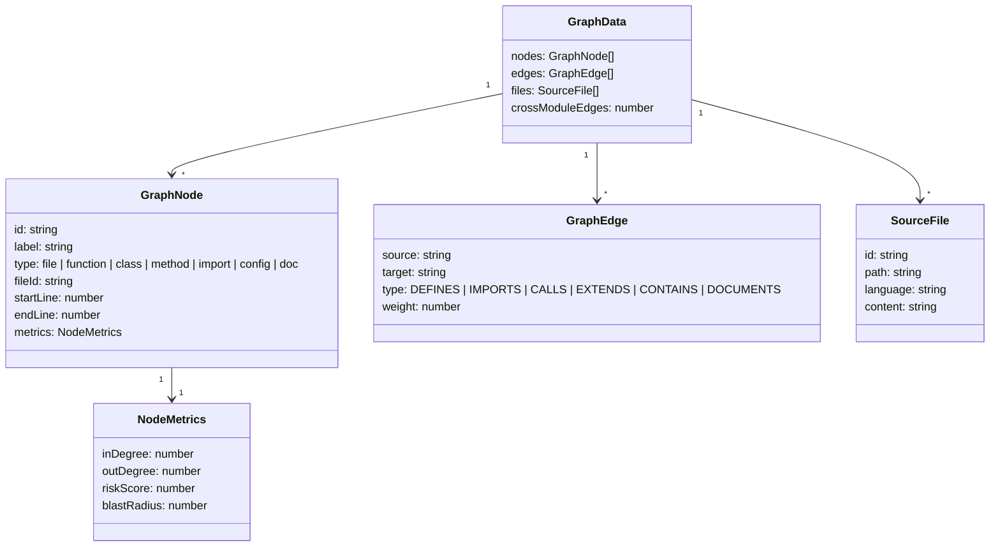
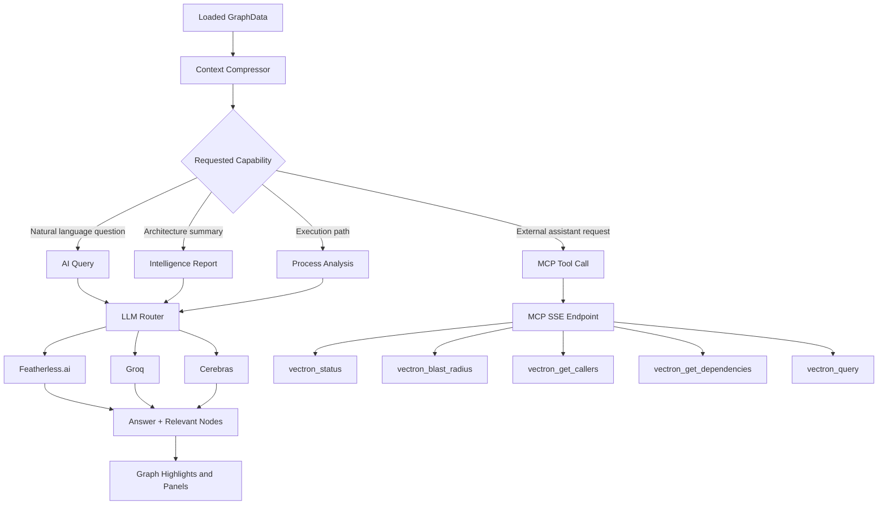
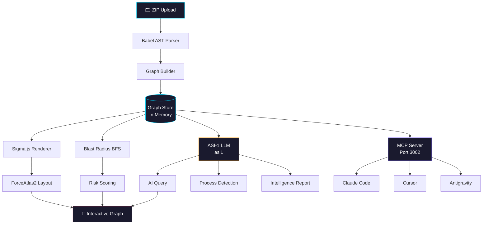

# VECTRON

**Dependency propagation engine for codebase intelligence**

> ChatGPT can explain a function. VECTRON shows what breaks when that function changes.

[](https://vectron-app.vercel.app)
[](https://github.com/LAZYGENIUS69/VECTRON)
[](LICENSE)

[Architecture](docs/ARCHITECTURE.md) · [MCP Guide](docs/MCP.md) · [API Reference](docs/API.md) · [Contributing](docs/CONTRIBUTING.md)

---

## What Is VECTRON?

VECTRON is an AI-powered dependency analysis workspace. Upload a JavaScript, TypeScript, Python, config, or documentation-heavy repository and VECTRON builds an interactive knowledge graph of files, functions, classes, imports, calls, ownership boundaries, and process flows.

It is built for the moment before a refactor, migration, or onboarding session, when the important question is not only "what does this code do?" but "what depends on it, what breaks if it changes, and where should I look next?"

---

## Live Demo

🔗 **[vectron-app.vercel.app](https://vectron-app.vercel.app)**

Upload a repository ZIP or analyze a public GitHub URL. No signup required.

---

## Core Capabilities

| Capability | What VECTRON Does |
|---|---|
| Dependency graph generation | Parses source files and builds a typed graph of files, functions, classes, imports, calls, docs, and config relationships. |
| Blast radius simulation | Runs downstream traversal from any selected node to show affected dependencies and impact depth. |
| Interactive graph workspace | Renders large dependency graphs with Sigma.js, Graphology, filtering, search, sidebars, and node intelligence panels. |
| Process flow detection | Finds execution flows and renders Mermaid diagrams for call chains and file transitions. |
| AI codebase query | Compresses graph context and routes analysis through Featherless.ai, Groq, and Cerebras. |
| Intelligence reports | Produces architecture summaries, risk analysis, onboarding guidance, and multi-agent insights. |
| MCP server | Exposes graph-aware tools to AI coding assistants through Model Context Protocol over SSE. |

---

## Screenshots

| View | Preview |
|---|---|
| Graph View |  |
| Blast Radius |  |
| Metrics Dashboard |  |
| AI Query |  |
| Process Flows |  |
| Intelligence Report |  |

---

## How It Works



---

## System Architecture



---

## Analysis Pipeline



---

## Graph Model



---

## AI and MCP Flow



---

## Quick Start

### Web (Instant)

Visit **[vectron-app.vercel.app](https://vectron-app.vercel.app)** and upload a repository ZIP.

### Local Development

```bash
git clone https://github.com/LAZYGENIUS69/VECTRON
cd VECTRON/vectron-app
npm install --prefix client
npm install --prefix server
npm run dev
```

Open:

```text
Frontend: http://localhost:5173
Backend:  http://localhost:3001
MCP SSE:  http://localhost:3002/sse
```

### Environment Variables

```env
FEATHERLESS_API_KEY=your_featherless_key_here
GROQ_API_KEY=your_groq_key_here
CEREBRAS_API_KEY=your_cerebras_key_here
CORS_ORIGIN=http://localhost:5173
PORT=3001
```

For Railway, add `FEATHERLESS_API_KEY`, `GROQ_API_KEY`, `CEREBRAS_API_KEY`, `CORS_ORIGIN`, and `PORT` in the service environment variables.

---

## API Surface

| Endpoint | Method | Purpose |
|---|---|---|
| `/api/upload` | POST | Upload and analyze a ZIP repository. |
| `/api/clone` | POST | Analyze a public GitHub repository URL. |
| `/api/query` | POST | Ask an AI question against the loaded graph. |
| `/api/processes` | POST | Detect execution flows and Mermaid process diagrams. |
| `/api/report` | POST | Generate an architecture and risk intelligence report. |
| `/api/node-summary` | POST | Generate node-level AI summaries. |
| `/api/file` | GET | Return cached source file contents. |
| `/health` | GET | Runtime health check. |

---

## MCP Tools

| Tool | Parameters | Description |
|---|---|---|
| `vectron_status` | none | Check whether a graph is loaded. |
| `vectron_blast_radius` | `nodeLabel`, `depth?` | Find downstream impact from a node. |
| `vectron_get_callers` | `nodeLabel` | List functions or files that call a node. |
| `vectron_get_dependencies` | `nodeLabel` | List direct dependencies for a node. |
| `vectron_query` | `question` | Ask a natural language question about the codebase. |

---

## Tech Stack

| Layer | Technology |
|---|---|
| Frontend | React, TypeScript, Vite |
| Graph Rendering | Sigma.js, Graphology, ForceAtlas2 |
| Backend | Express, Node.js, TypeScript |
| Parsing | Babel parser, custom Python/config/docs parsers |
| AI Layer | Featherless.ai, Groq, Cerebras |
| Process Diagrams | Mermaid |
| MCP | `@modelcontextprotocol/sdk` |
| Deployment | Railway, Nixpacks |

---

## Why VECTRON?

| Feature | VECTRON | General Chatbot | Code Completion Tool |
|---|---|---|---|
| Full dependency graph | Yes | No | No |
| Blast radius simulation | Yes | No | No |
| Interactive graph exploration | Yes | No | Limited |
| Codebase-aware MCP tools | Yes | No | No |
| Risk scoring | Yes | No | No |
| Process flow diagrams | Yes | No | No |
| Multi-provider AI layer | Yes | Limited | Limited |
| Self-hostable | Yes | No | Sometimes |

---

## Roadmap

- Deeper multi-provider AI orchestration for codebase analysis.
- Persistent graph storage for long-lived workspaces.
- Broader parser support for Java, Go, Rust, and C#.
- Team sharing controls for graph links and reports.
- More MCP tools for refactor planning and impact-aware code review.

---

## Contributing Guide

1. Fork the repo and create a feature branch.
2. Run the client and server locally from `vectron-app/`.
3. Keep changes scoped and verify with local builds before opening a PR.
4. Document any new endpoints, MCP tools, or UI workflows in the README.
5. Open a pull request with screenshots if the change affects the interface.

---

## What's Next

- ASI:One Agentverse Integration — register custom VECTRON agents on the Agentverse marketplace for deeper orchestration

---

## Architecture



---

*Made with obsession by [@LAZYGENIUS69](https://github.com/LAZYGENIUS69)*
