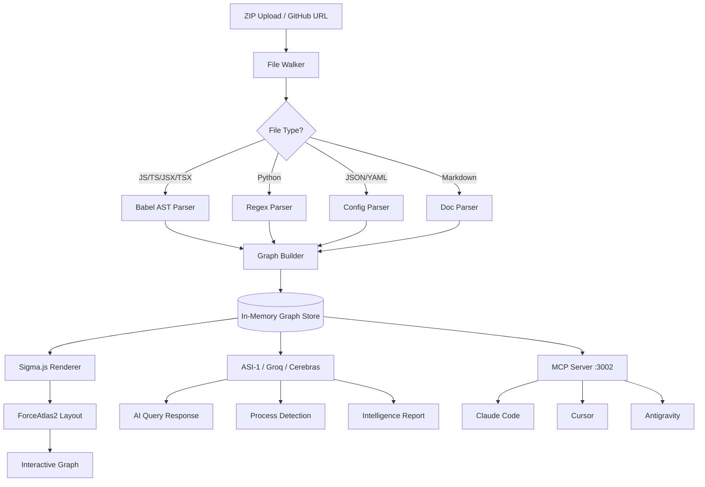
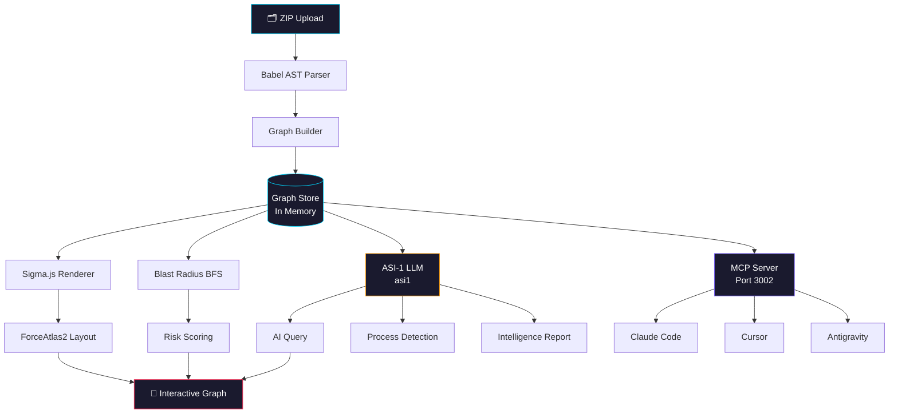

# VECTRON
**dependency propagation engine**

> "ChatGPT can tell you what a function does.  
> VECTRON shows you what breaks when you change it."

[](https://vectron-production.up.railway.app)
[](https://github.com/LAZYGENIUS69/VECTRON)
[](LICENSE)

📖 [Architecture](docs/ARCHITECTURE.md) · 🔌 [MCP Guide](docs/MCP.md) · 🚀 [API Reference](docs/API.md) · 🤝 [Contributing](docs/CONTRIBUTING.md)

---

## What is VECTRON?

VECTRON is an AI-powered codebase dependency explorer. Upload any JavaScript or TypeScript repository as a ZIP and instantly get an interactive knowledge graph of every file, function, class and their relationships.

The average developer spends **58% of their time understanding code, not writing it.** VECTRON eliminates that.

---

## Screenshots

### Graph View


### Blast Radius Simulation


### Metrics Dashboard


### AI Query


### Process Flows


### Metrics


---

## Live Demo

🔗 **[vectron-production.up.railway.app](https://vectron-production.up.railway.app)**

Upload any JS/TS repo as a ZIP. No signup. No setup.

---

## Features

### 🔴 Blast Radius Simulation
Click any node in the graph. VECTRON instantly runs a BFS propagation to show every downstream dependency that breaks if you change it. Color-coded by impact depth — red is direct, orange is one hop, yellow is two hops.

### 🤖 AI Codebase Query
Ask anything about your codebase in plain English. VECTRON sends a compressed graph summary to ASI-1 first, then falls back to Groq and Cerebras if needed, and returns a precise answer with a call chain while simultaneously highlighting the relevant nodes on the graph.

### 📊 Metrics Dashboard
Risk scores, dependency hotspots, node type distribution, top 10 most connected nodes. Instantly identifies your most fragile code.

### 🔀 Process Flow Detection
Automatically detects all execution flows in the codebase and generates Mermaid flowcharts for each one. Click any process to see the complete call chain visualized.

### 🔍 Node Intelligence
Click any node to instantly see its complete intelligence profile:
- **Risk Score** — calculated from connection density
- **Callers & Callees** — exact count of incoming and outgoing dependencies  
- **Depends On** — direct dependencies as visual pills
- **Called By** — everything that depends on this node
- **AI Summary** — one-line AI description of what the node does

### 🔗 Process Tracing
Select any two nodes and VECTRON traces the exact execution path between them through the dependency graph. See how data flows from a user action all the way through to the output — every hop, every function call, every file transition visualized as a Mermaid flowchart.

### 📄 Codebase Intelligence Report
One click generates a full architecture document — executive summary, component breakdown, risk assessment, onboarding guide. Powered by ASI-1 with Groq and Cerebras as fallback

Five specialized AI agents analyze your codebase simultaneously:

🔴 Security Agent — identifies vulnerabilities, exposed endpoints, authentication gaps, and attack surface

🔵 Architecture Agent — detects circular dependencies, coupling issues, separation of concerns violations, and design pattern problems

🟡 Performance Agent — finds hot paths, bottlenecks, heavily called functions, and expensive dependency chains

🟢 Code Quality Agent — flags dead code, god functions, duplication, and naming inconsistencies

⚡ Onboarding Agent — generates a learning path, explains core data flows, and identifies the 5 most important files for new developers


### 🤖 Custom LLM Configuration
Bring your own API key. Configure any LLM provider directly in the UI:
- ASI:One (default, primary)
- OpenAI
- Anthropic
- Groq
- Cerebras
- Any OpenAI-compatible endpoint

### 🔗 GitHub URL Analysis
Paste any public GitHub repository URL directly — no ZIP download needed. VECTRON fetches and analyzes the repo instantly.

### 🔗 Shareable Graph Links
Generate a unique URL to share your dependency graph with anyone. Links expire after 24 hours.

### 🧠 MCP Server — AI-Native Codebase Context
**This is where VECTRON becomes truly powerful.**

VECTRON runs as an MCP (Model Context Protocol) server on port 3002. Connect it to Claude Code, Cursor, or Antigravity and your AI coding assistant gets full dependency context while you code.

```
# Add to your MCP client
Name: VECTRON
URL:  http://localhost:3002/sse
```

**Available MCP Tools:**

| Tool | Description |
|------|-------------|
| `vectron_status` | Check if a graph is loaded |
| `vectron_blast_radius(node, depth?)` | What breaks if I change this? |
| `vectron_get_callers(node)` | What calls this function? |
| `vectron_get_dependencies(node)` | What does this depend on? |
| `vectron_query(question)` | Ask anything about the codebase |

**Example:**
```
You: "I want to refactor handleUpload. Use VECTRON to check what will break."

AI (with VECTRON MCP):
→ calls vectron_blast_radius("handleUpload")
→ finds 8 affected files
→ calls vectron_get_callers("handleUpload")  
→ returns exact line numbers
→ "Update these 8 files in this order..."

AI (without VECTRON):
→ misses 5 files
→ your build breaks
```

---

## Powered by ASI:One

VECTRON uses ASI:One as its primary intelligence layer.

ASI:One's unique capabilities enable:

Multi-Agent Orchestration — 5 specialized agents run in parallel, each with domain expertise, reasoning independently before synthesizing results

Extended Reasoning — deep multi-step analysis for the Intelligence Report, breaking down architectural decisions with intermediate validation steps

Unified Intelligence — one model that automatically activates the right reasoning mode based on the task — fast inference for queries, extended reasoning for reports, agentic orchestration for analysis

To use VECTRON with your own ASI:One key:
1. Open the ASK AI tab
2. Click the gear icon
3. Select ASI:One as provider
4. Enter your API key from api.asi1.ai

---

## How It Works



---

## Performance

| Codebase Size | Files | Parse Time | Nodes | Edges |
|---------------|-------|------------|-------|-------|
| Small | <50 files | ~2s | ~100 | ~200 |
| Medium | 50-200 files | ~5s | ~500 | ~1000 |
| Large | 200-500 files | ~10s | ~1300 | ~4000 |
| XL | 500+ files | ~20s | ~2000+ | ~8000+ |

---

## Why VECTRON?

| Feature | VECTRON | ChatGPT | GitHub Copilot |
|---------|---------|---------|----------------|
| Visual dependency graph | ✅ | ❌ | ❌ |
| Blast radius simulation | ✅ | ❌ | ❌ |
| Interactive graph exploration | ✅ | ❌ | ❌ |
| MCP server for AI agents | ✅ | ❌ | ❌ |
| Works on any size codebase | ✅ | ❌ (context limit) | ⚠️ |
| Risk scoring | ✅ | ❌ | ❌ |
| Process flow detection | ✅ | ❌ | ❌ |
| No setup required | ✅ | ✅ | ❌ |
| Self-hosted | ✅ | ❌ | ❌ |
| Custom LLM support | ✅ | ❌ | ❌ |

---

## Quick Start

### Web (Instant)
Visit **[vectron-production.up.railway.app](https://vectron-production.up.railway.app)** and upload a ZIP.

### Local + MCP Setup
```bash
git clone https://github.com/LAZYGENIUS69/VECTRON
cd VECTRON/vectron-app
npm install --prefix client && npm install --prefix server
cp .env.example server/.env
# Add your API keys to server/.env
npm run dev
```

Open `http://localhost:5173` — upload a ZIP — then connect MCP:
```
http://localhost:3002/sse
```

### Environment Variables
```env
GROQ_API_KEY=your_groq_key_here
CEREBRAS_API_KEY=your_cerebras_key_here
ASI1_API_KEY=your_asi1_key_here
PORT=3001
```

Get your ASI:One API key free at: https://api.asi1.ai

Get free API keys:
- Groq: [console.groq.com](https://console.groq.com)
- Cerebras: [inference.cerebras.ai](https://inference.cerebras.ai)

For Railway, add `ASI1_API_KEY`, `GROQ_API_KEY`, `CEREBRAS_API_KEY`, and `PORT` in the service environment variables before deploying.

---

## Tech Stack

| Layer | Technology |
|-------|-----------|
| Frontend | React + TypeScript + Vite |
| Graph Rendering | Sigma.js + Graphology + ForceAtlas2 |
| Backend | Express.js + Node.js |
| AST Parsing | Babel (JS/TS/JSX/TSX) |
| AI Primary | ASI-1 — `asi1` |
| AI Fallback | Groq, then Cerebras |
| ASI:One API | Primary AI provider — multi-agent orchestration |
| Groq | Fallback LLM — Llama 3.3 70B |
| Cerebras | Fallback LLM — Llama 3.1 8B |
| Process Diagrams | Mermaid.js |
| MCP Protocol | @modelcontextprotocol/sdk |
| Deployment | Railway |

---

## MCP Tools Reference

| Tool | Parameters | Description |
|------|-----------|-------------|
| `vectron_status` | none | Check if graph is loaded |
| `vectron_blast_radius` | `nodeLabel`, `depth?` | What breaks if I change this? |
| `vectron_get_callers` | `nodeLabel` | What calls this function? |
| `vectron_get_dependencies` | `nodeLabel` | What does this depend on? |
| `vectron_query` | `question` | Natural language codebase question |

---

## API Reference

| Endpoint | Method | Description |
|----------|--------|-------------|
| `/api/upload` | POST | Upload ZIP file for analysis |
| `/api/clone` | POST | Analyze GitHub repo by URL |
| `/api/query` | POST | AI natural language query |
| `/api/processes` | POST | Detect process flows |
| `/api/report` | POST | Generate intelligence report |
| `/api/node-summary` | POST | Generate node-level AI summary |
| `/api/file` | GET | Fetch cached file contents by path |
| `/health` | GET | Server health check |

---

## Contributing Guide

1. Fork the repo and create a feature branch.
2. Run the client and server locally from `vectron-app/`.
3. Keep changes scoped and verify with local builds before opening a PR.
4. Document any new endpoints, MCP tools, or UI workflows in the README.
5. Open a pull request with screenshots if the change affects the interface.

---

## What's Next

- ASI:One Agentverse Integration — register custom VECTRON agents on the Agentverse marketplace for deeper orchestration

---

## Architecture



---

*Made with obsession by [@LAZYGENIUS69](https://github.com/LAZYGENIUS69)*
