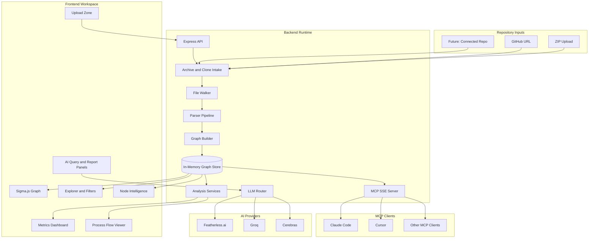
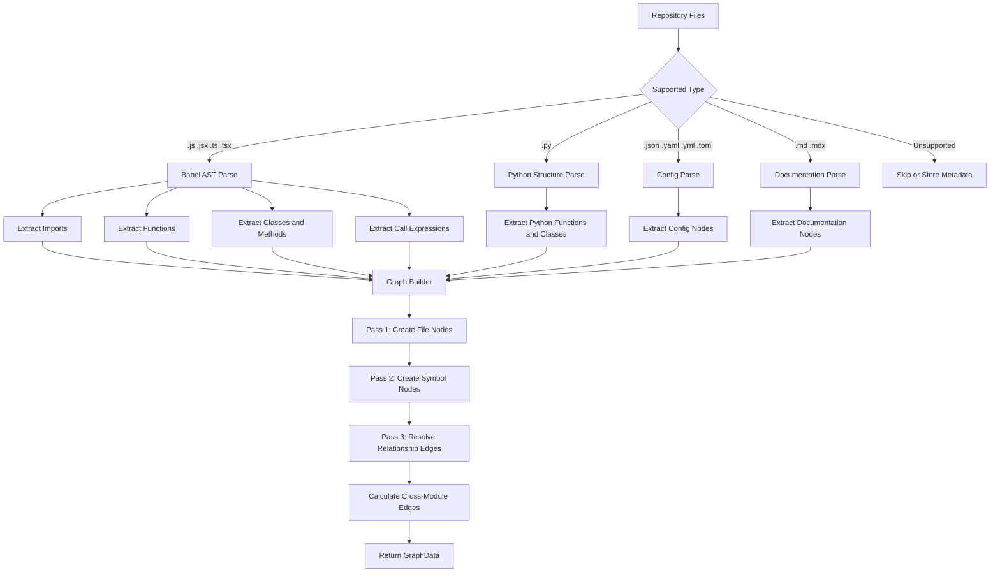
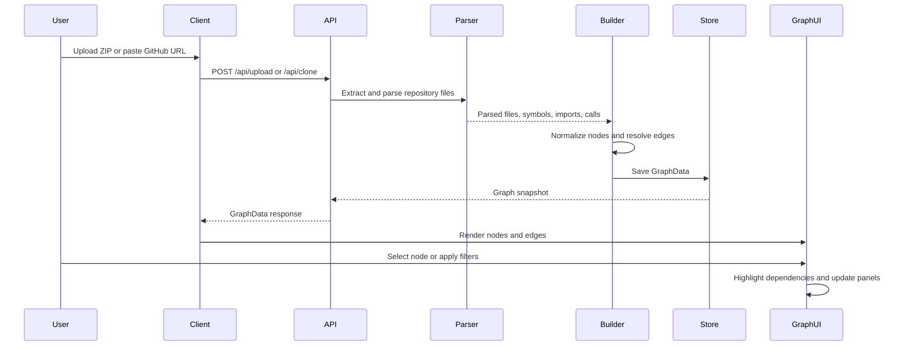
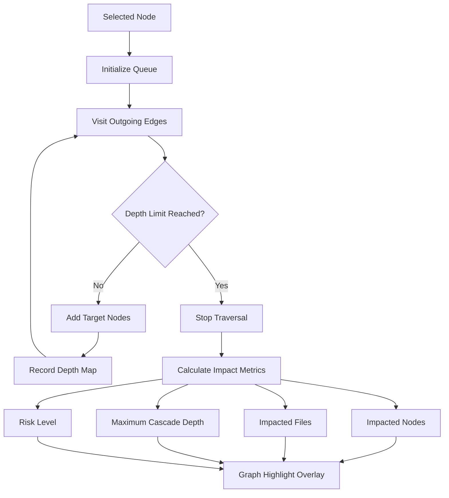
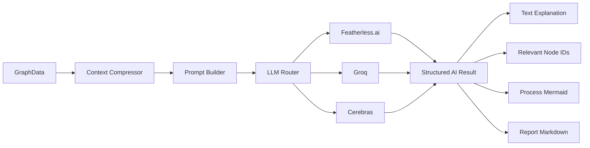
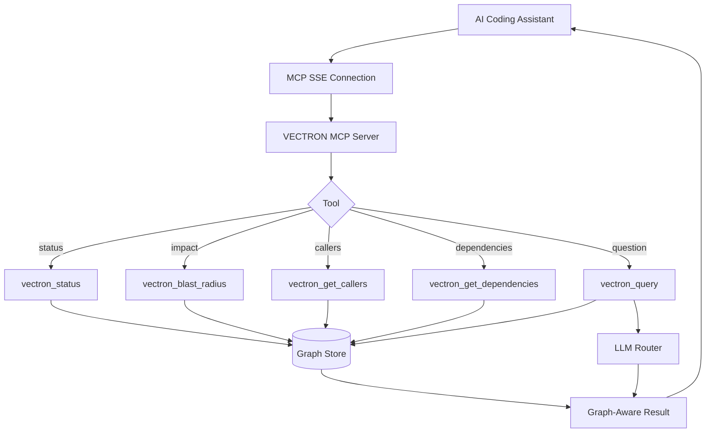

# VECTRON Architecture

VECTRON is a full-stack dependency intelligence system. It turns source repositories into a graph-backed analysis workspace for refactor planning, onboarding, process tracing, risk scoring, AI codebase queries, and MCP-powered coding assistants.

---

## System Layers



---

## Parsing and Graph Construction



---

## Graph Relationship Types

```mermaid
erDiagram
    FILE ||--o{ SYMBOL : DEFINES
    FILE ||--o{ FILE : IMPORTS
    FUNCTION ||--o{ FUNCTION : CALLS
    CLASS ||--o{ CLASS : EXTENDS
    FILE ||--o{ CONFIG : CONTAINS
    DOC ||--o{ FILE : DOCUMENTS

    FILE {
        string id
        string path
        string language
        string content
    }

    SYMBOL {
        string id
        string label
        string type
        string fileId
        number startLine
        number endLine
    }

    CONFIG {
        string id
        string label
        string fileId
    }

    DOC {
        string id
        string label
        string fileId
    }
```

---

## Request Lifecycle



---

## Blast Radius Algorithm



---

## AI Layer Flow



---

## MCP Integration



---

## Key Design Decisions

| Decision | Reason |
|---|---|
| In-memory graph store | Keeps single-session analysis fast and simple for uploaded repositories. |
| Sigma.js and Graphology | WebGL rendering handles larger graphs more comfortably than SVG-heavy approaches. |
| Babel parser for JS/TS | Mature support for modern JavaScript, TypeScript, JSX, and TSX syntax. |
| Multi-provider AI layer | Keeps graph-aware reasoning available through Featherless.ai, Groq, and Cerebras. |
| MCP SSE server | Lets external AI coding tools query the same graph context visible in the UI. |
| Railway and Nixpacks | Keeps deployment lightweight while supporting client and server builds. |

---

## Runtime Structure

```text
vectron-app/
|-- client/
|   |-- src/
|   |   |-- components/       Workspace UI, graph panels, reports, process views
|   |   |-- lib/              API helpers and client-side graph metrics
|   |   |-- types/            Shared GraphData types
|   |   `-- App.tsx           Primary application shell
|   `-- package.json
|-- server/
|   |-- src/
|   |   |-- index.ts          Express API routes and LLM orchestration
|   |   |-- parser.ts         Source parsing and symbol extraction
|   |   |-- graph-builder.ts  GraphData assembly and relationship resolution
|   |   |-- graph-store.ts    Current graph singleton
|   |   `-- mcp-server.ts     MCP tools over SSE
|   `-- package.json
|-- nixpacks.toml             Railway build/start commands
`-- package.json              App-level development and production scripts
```
