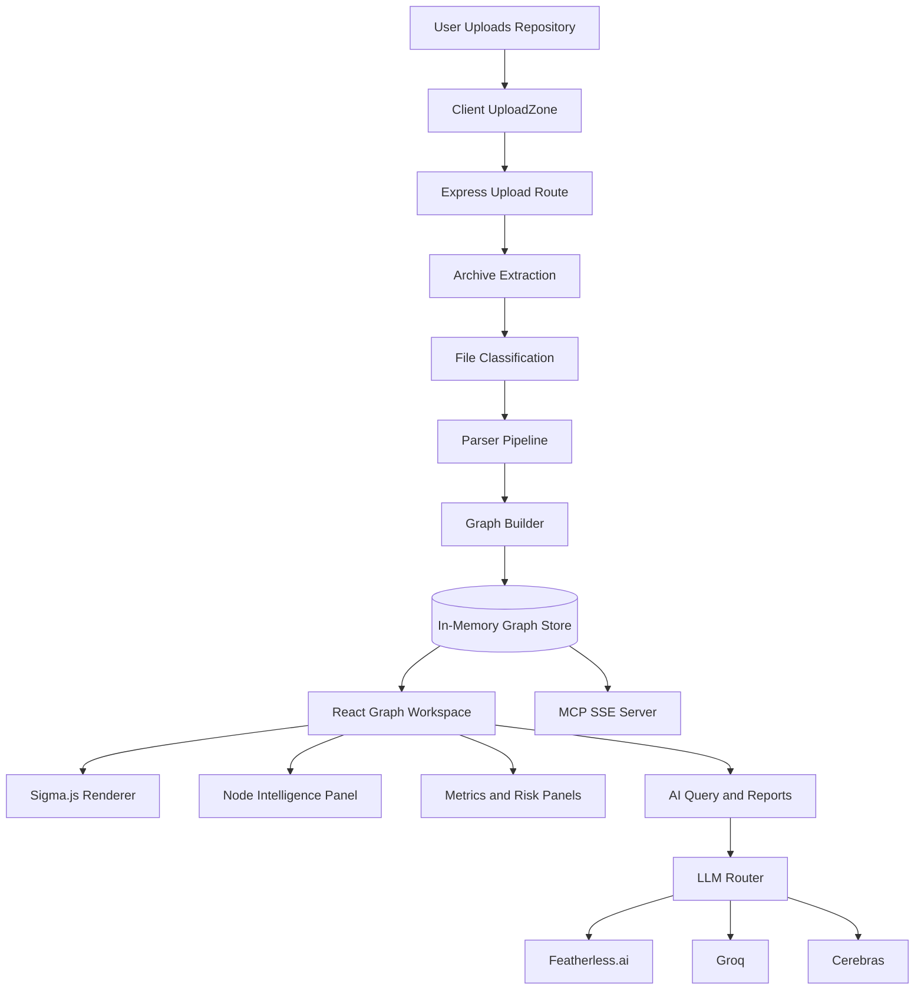
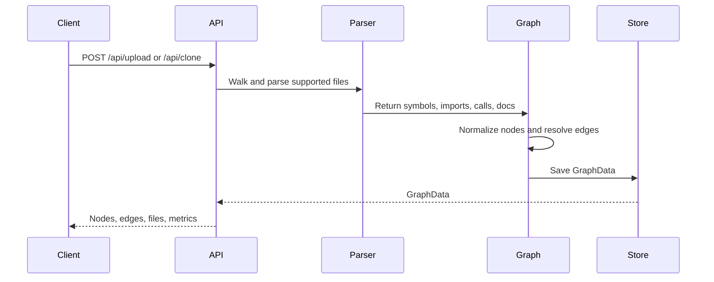
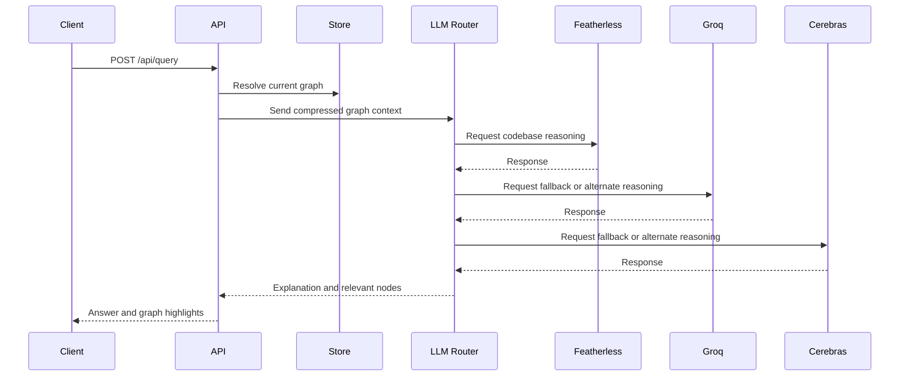

# VECTRON App

**Full-stack dependency intelligence workspace**

This directory contains the runnable VECTRON application:

- `client/`: React, TypeScript, Vite, Sigma.js graph workspace.
- `server/`: Express API, parser pipeline, graph builder, AI routes, MCP server.

---

## Local Development

```bash
cd vectron-app
npm install --prefix client
npm install --prefix server
npm run dev
```

Open the running services:

```text
Frontend: http://localhost:5173
Backend:  http://localhost:3001
MCP SSE:  http://localhost:3002/sse
```

---

## Production Build

```bash
cd vectron-app
npm run build
npm run start
```

The client build is generated by Vite and the server build is generated by TypeScript.

---

## Environment

Create `server/.env` for local development:

```env
FEATHERLESS_API_KEY=your_featherless_key_here
GROQ_API_KEY=your_groq_key_here
CEREBRAS_API_KEY=your_cerebras_key_here
CORS_ORIGIN=http://localhost:5173
PORT=3001
```

---

## Application Flow



---

## Project Structure

```text
vectron-app/
|-- client/
|   |-- src/
|   |   |-- components/       React UI panels and graph views
|   |   |-- lib/              Client-side risk and API helpers
|   |   |-- types/            Shared graph types
|   |   `-- App.tsx           Main workspace shell
|   `-- package.json
|-- server/
|   |-- src/
|   |   |-- index.ts          Express API and AI routes
|   |   |-- parser.ts         Source parsing pipeline
|   |   |-- graph-builder.ts  Graph construction logic
|   |   |-- graph-store.ts    In-memory graph state
|   |   `-- mcp-server.ts     MCP SSE tools
|   `-- package.json
|-- nixpacks.toml             Railway build/start configuration
`-- package.json              Workspace scripts
```

---

## Key Workflows

### Repository Analysis



### AI Insight Generation



---

## Scripts

| Command | Description |
|---|---|
| `npm run dev` | Start client and server development processes. |
| `npm run install:all` | Install client and server dependencies. |
| `npm run build` | Build client and server for production. |
| `npm run start` | Start the compiled server. |

---

## Notes

- The graph is stored in memory for fast single-session analysis.
- Sigma.js handles interactive graph rendering in the browser.
- MCP tools expose the loaded graph to AI coding assistants.
- The AI layer uses Featherless.ai, Groq, and Cerebras for graph-aware reasoning.
